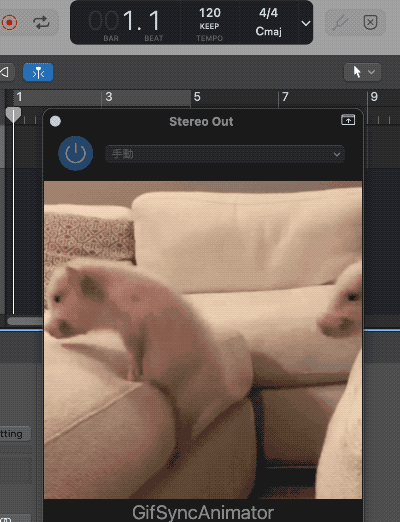
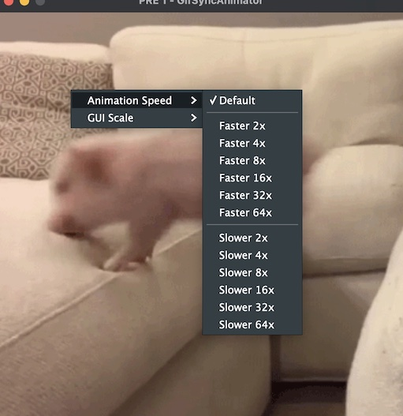

GifSyncAnimator
=======================

GifSyncAnimator は、DAW (Digital Audio Workstation) 上で GIF アニメーションを同期再生するプラグインです。


gif file from [Giphy](https://giphy.com/gifs/party-pizza-pizza58e2a1c2e81a0281819863-Ub8XEam5vXbMY)

## 対応OS

| OS                            | VST3 | AU  |
| ----------------------------- | ---- | --- |
| Windows (Intel x86_64)        | ✔   |     |
| macOS (AppleSilicon arm64) *1 | ✔   | ✔  |
| macOS (Intel x86_64) *1       | ✔   | ✔  |

\*1 macOS では、現在プラグイン本体の配布は行っていません。
DAWを使用する Mac 上でビルドを行う必要があります。詳しは、[macOSユーザーの方へ](#for_mac_users) を参照してください

## 注記

### マウス操作の表記について

> [!NOTE]
> - このドキュメント内でのマウスのクリック、右クリックはOSデフォルトの `右手の設定` を想定しています
> - 左手設定に対応していますので、OSで左手設定にしている場合は、左右を逆に読み替えてください

## 使い方

1. プラグインを DAW 上でロードし、ウィンドウ内をクリックするとファイル選択ダイアログが開きます
2. DAW 上で再生すると、GIF アニメーションが同期再生されます

## アニメーション速度の調整

デフォルトでは 1 小節で1ループするアニメーションを行います。
早すぎる、遅すぎる場合は、アニメーション速度を調整できます。

1. GIF ファイルロード後、ウィンドウ内を右クリックすると、ポップアップメニューが開きます
2. ポップアップメニュー内の項目を選択して、再生速度を調整できます



## 動作確認済みのDAW

- Studio One
- Logic Pro X

<a id="for_mac_users"></a>

## macOSユーザーの方へ

> [!IMPORTANT]
> macOS では、macOSのセキュリティ上の仕様と Apple Developer Program の関係上、現在配布は行っていません。お使いの Mac 上でビルドを行う必要があります
> 私が Apple Developer Program に参加してAppleから発行される署名を用いることで配布可能になりますが、現時点ではその予定はありません

## ソースコードからビルドする

### 共通

1. このリポジトリをクローンしてください

```bash
git clone git@github.com:r-koubou/GifSyncAnimator.git
```

2. 外部の git サブモジュールを cloneしてください

```bash
git submodule update --init --recursive
```


### Windows

1. 以下のソフトウェアをインストールしてください
- Visual Studio 2022
- CMake 3.15 以上
  - 環境変数PATHに cmake.exe のパスを追加してください

2. build.win.release.bat を実行すると、ビルドが行われます

### macOS

1. 以下のソフトウェアをインストールしてください
- Xcode
- CMake 3.15 以上
  - Homebrewでインストール可能です
    - `brew install cmake`

2. build.mac.release.sh を実行すると、ビルドが行われます


### ビルドされたプラグインの場所

- デバッグビルド: `build/GifSyncAnimator_artefacts/debug`
- リリースビルド: `build/GifSyncAnimator_artefacts/release`

## ライセンス

- GPL v3